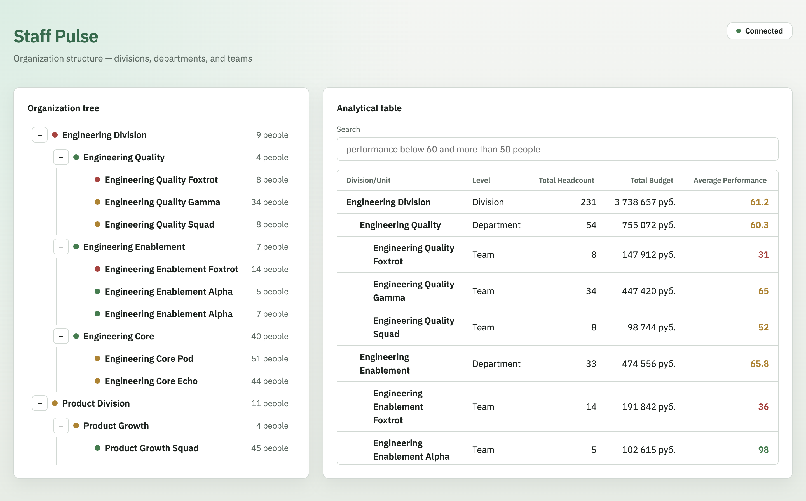
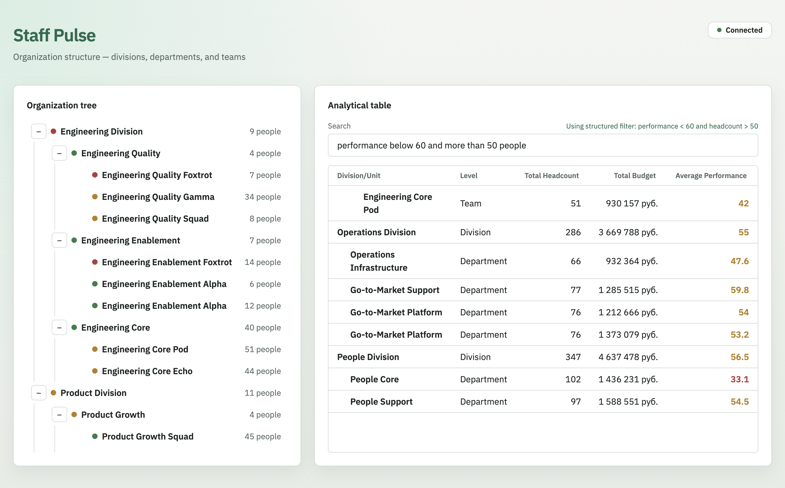
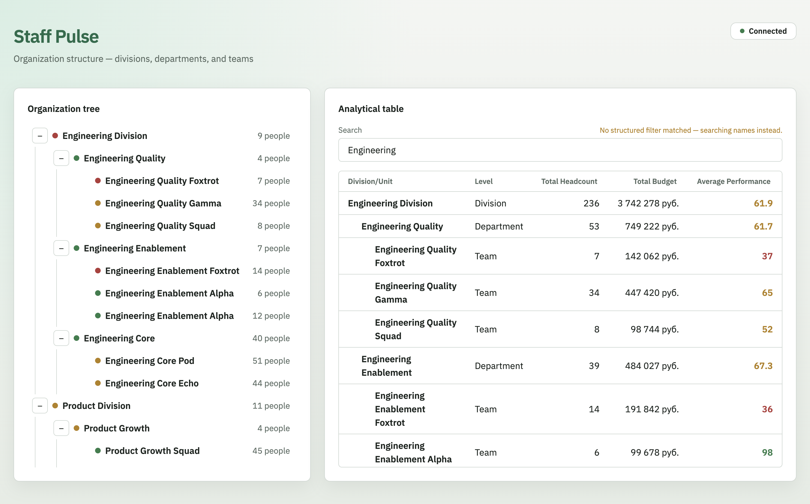

# Staff Pulse Dashboard

Org-structure monitoring dashboard: interactive tree view + analytical table
over a hierarchical dataset (divisions → departments → teams), with real-time
updates and a rule-based natural-language search.

## Stack

React · Vite · TypeScript · styled-components · nginx (production)

## Quick start

### Local development

```bash
npm install
cp env.example .env   # once
npm run dev:all       # client (Vite :5173) + mock API (:4000)
```

Or in two terminals:

```bash
npm run dev:server    # mock API on :4000
npm run dev           # client on :5173
```

Open http://localhost:5173. The client reads `VITE_API_URL` and
`VITE_REALTIME_URL` from `.env`.

### Docker (nginx + mock API)

```bash
cp env.example .env   # once; CLIENT_PORT defaults to 8080
docker compose up --build
```

Open http://localhost:8080. nginx serves the production client with gzip
and proxies `/api` (including the SSE stream) to the mock-server
container. The image is built with same-origin URLs
(`DOCKER_VITE_API_URL` empty, `DOCKER_VITE_REALTIME_URL=/api/org-tree/stream`).

## Project structure

```
src/            # client (see AGENTS.md for the layout)
  ai-search/    # NL → structured table predicates, or name fallback
mock-server/    # standalone mock API (in-memory; SSE live updates)
nginx/          # gzip static files + /api reverse proxy
docs/           # architecture.md, data-model.md, requirements.md, adr/
```

## Development stages

| Stage | Tag | Description |
|---|---|---|
| 01 Foundation | `step/1` | scaffold, mock API, tree view |
| 02 Core | `step/2` | analytical table, aggregation |
| 03 Polish | `step/3` | live updates, keyboard nav, animations |
| 04 Bonus | `step/4` | Docker, production build, AI search |

## AI in development

See [`AI_LOG.md`](AI_LOG.md) for the stage-by-stage log.

- **Tools used**: Cursor (agent)
- **Generated as-is**: Vite/React scaffold, mock org-tree, SWR-style cache,
  tree view, aggregation + table, SSE live patches, Docker/nginx, rule-based
  NL parser, Vitest cases, ADRs 001–008
- **Rewritten / decided**: cache abort semantics (stage 01); split-view at
  1280px plus a narrow toggle; ancestor-only rollups instead of `useMemo` on
  array identity for live patches; SSE over WebSocket/polling; rule-based
  search instead of an LLM so `docker compose up` needs no API key — see
  `AI_LOG.md` and ADR 008
- **Rough split**: mostly agent-generated with review against requirements
  (weighted average, debounce, single `selectedId`, reactive filter)

### Stage notes

1. **Foundation** — flat `OrgNode[]` as the only stored dataset; tree is a
   derived view. Shared-cache cancellation uses subscriber ref-counting.
2. **Core** — one `selectedId` for tree and table; aggregation memoized on
   array identity (later replaced for patches).
3. **Polish** — in-place metric patches, ancestor-only rollup updates, cell
   fade, keyboard grid, animated tree collapse with `prefers-reduced-motion`.
4. **Bonus** — nginx gzip + `/api` proxy; NL comparisons parse to
   `{ field, operator, value }[]` applied in `useMemo` on current rows; name
   search fallback is shown to the right of the Search label, above the input.

## Testing

```bash
npm run test          # aggregation, patches, backoff, keyboard, AI search
npm run analyze       # production build + reports/bundle-stats.html
npm run gzip-size     # dist gzip vs the 200KB budget
```

Cases required by [`docs/data-model.md`](docs/data-model.md): empty tree, a
leaf with no children, and a node with one descendant (headcount-weighted
average). Zero-headcount → average 0 is also covered.

To exercise client empty / error UI against the mock API:

```bash
MOCK_FORCE=empty npm run dev:server
MOCK_FORCE=error npm run dev:server
```

## Production bundle

Vite production JS: **113.0 KB gzip** (budget **200 KB**). Analyzer:
`npm run analyze` → `reports/bundle-stats.html`.

## Screenshots

Split view (tree + table) through nginx:



Structured natural-language filter:



Unrecognized query falls back to name search (note above the input, on the right):



## Documentation

- [`AGENTS.md`](AGENTS.md) — conventions and constraints for AI agents
- [`docs/requirements.md`](docs/requirements.md) — assignment scope and stages
- [`docs/architecture.md`](docs/architecture.md) — layers and data flow
  (Stage 04 as implemented)
- [`docs/data-model.md`](docs/data-model.md) — node shape, tree, aggregation,
  SSE patch contract, AI-search predicates
- [`docs/adr/`](docs/adr/) — architecture decision records
